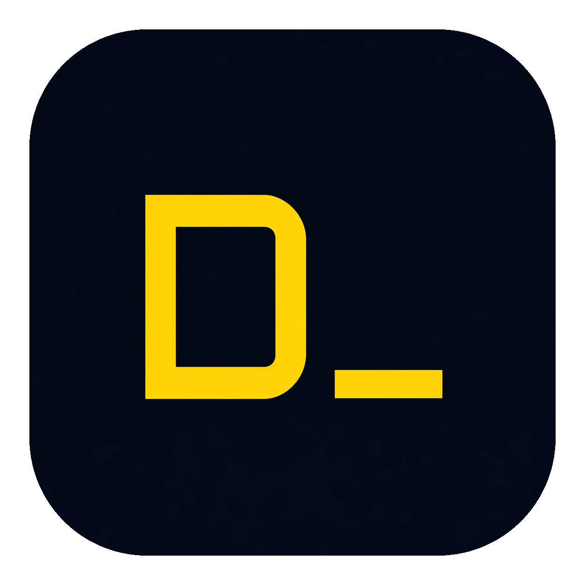

# Dash

**Run Claude Code across every project, in one window.**

Dash is a cross-platform desktop app that gives each of your projects its own tab — complete with a real terminal running [Claude Code](https://docs.claude.com/en/docs/claude-code/overview), a git panel, and a bottom-docked shell for your dev servers and scripts.

[Download](https://github.com/HgGamer/DDash/releases/latest) · [Report a bug](https://github.com/HgGamer/DDash/issues) · [Claude Code docs](https://docs.claude.com/en/docs/claude-code/overview)

---

## Features

- **Tabs per project.** Add a folder once; Dash remembers it and spawns a fresh `claude` session in that directory every time you open the tab.
- **Real terminals.** PTY-backed, not a fake web shell — colors, prompts, TUIs, and interactive flows all work as they do in your normal terminal.
- **Git panel.** Stage, unstage, discard, commit, switch branches, create branches, push, browse history (~500 commits), and manage stashes (push, pop, apply, drop with diff preview) without leaving the tab.
- **Integrated terminal dock.** A bottom-docked shell for dev servers, tests, and scripts — per-project tabs, backgrounded processes survive collapsing the panel.
- **Worktree-aware.** Worktree tabs pin to their branch so you don't accidentally switch them out from under your work.
- **Your shell, your PATH.** Dash resolves `claude` against your login shell, so whatever works in your terminal works here.
- **Cross-platform.** macOS (arm64 + x64), Windows, and Linux.

## Install

Grab the latest build for your platform from the [releases page](https://github.com/HgGamer/DDash/releases/latest):

- **macOS** — `.dmg` (Apple Silicon and Intel)
- **Windows** — NSIS installer (`.exe`)
- **Linux** — `.AppImage` or `.deb`

Builds are currently unsigned, so your OS may warn you on first launch. On macOS, right-click the app and choose **Open** once to allow it.

## Prerequisites

Dash runs Claude Code — it does not bundle it. You need the **Claude Code CLI** installed and available on your `PATH`:

- Install: <https://docs.claude.com/en/docs/claude-code/quickstart>
- Verify: run `claude --version` in your normal terminal.

## Getting started

1. Launch Dash.
2. Press **Cmd+O** (macOS) / **Ctrl+O** (Windows/Linux) or click **Add Project** and pick a folder.
3. The tab opens and `claude` starts in that directory. Talk to it like you would in any terminal.
4. Add more projects — switch between them with **Cmd/Ctrl+1..9** or **Cmd+Alt+←/→** (Ctrl+Tab on Win/Linux).
5. Toggle the **Git** panel on the right, or the bottom **Terminal** dock with **Cmd/Ctrl+`**.

## Keyboard shortcuts

| Action             | macOS           | Windows / Linux    |
| ------------------ | --------------- | ------------------ |
| Add project        | Cmd+O           | Ctrl+O             |
| Remove active tab  | Cmd+Backspace   | Ctrl+Delete        |
| Next tab           | Cmd+Alt+Right   | Ctrl+Tab           |
| Previous tab       | Cmd+Alt+Left    | Ctrl+Shift+Tab     |
| Go to tab 1..9     | Cmd+1..9        | Ctrl+1..9          |
| Toggle terminal    | Cmd+`           | Ctrl+`             |
| New terminal tab   | Cmd+Shift+`     | Ctrl+Shift+`       |

## Updates

Dash checks GitHub Releases for new versions in the background — once at startup and every 6 hours afterward. Updates download silently and install when you next quit the app, so running terminal sessions are never interrupted by a surprise restart. You can also click **Restart and update** in **Settings → Updates** to install immediately, or **Check for updates…** to check on demand.

- **Channel**: choose between *Stable* (default) and *Beta* (pre-releases) under **Settings → Updates**.
- **Disable auto-checks**: turn off **Automatically check for updates** in the same panel. The manual check still works.
- **Linux `.deb`**: updates are managed by your system package manager. The AppImage build auto-updates normally.
- **Network**: this is the only outbound network call Dash makes on its own; it talks to GitHub's release API and CDN.

## Troubleshooting

**"Claude not found"** — Dash uses your login shell's `PATH`. If `claude` works in your terminal but Dash can't find it, make sure the `PATH` export is in your login-shell rc file (`.zprofile`, `.bash_profile`, `.profile`) — not only in `.bashrc` / `.zshrc`'s non-login branch. Quit and relaunch Dash after fixing.

**"Project path not found"** — The folder was moved, renamed, or deleted after you added it. Click **Remove project** and re-add it, or restore the folder.

**Git panel is blank** — Dash uses the system `git` binary. Make sure `git` is on your `PATH`. You can also turn the panel off entirely under **Settings → Git**.

**Update never installs (macOS / Windows)** — `electron-updater` only installs signed builds. Verify the release was published with valid Developer ID / code-signing certificates. The error in **Settings → Updates** usually names the cause (e.g. signature mismatch). On macOS, also check Console.app for `com.apple.security.cs` or notarization errors.

## Status

Alpha. Local projects only — no SSH / remote directories yet. Builds are unsigned.

## License

MIT. See [LICENSE](LICENSE) if present, or the `license` field in `package.json`.
